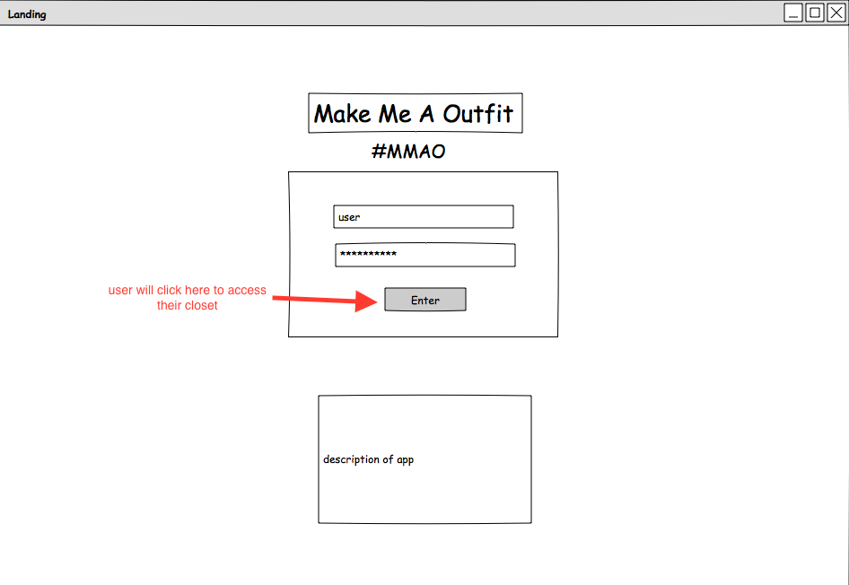
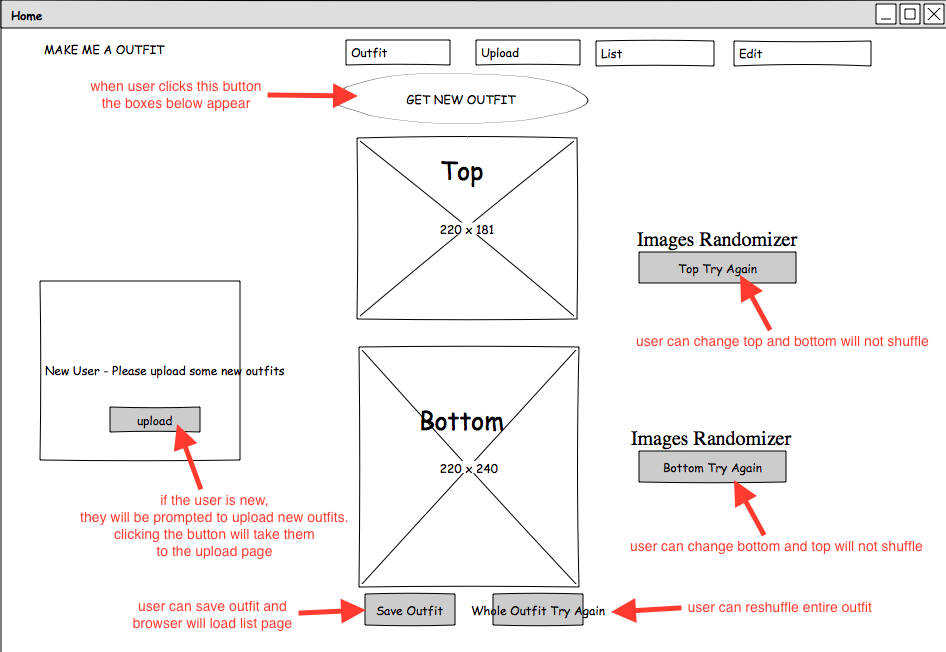
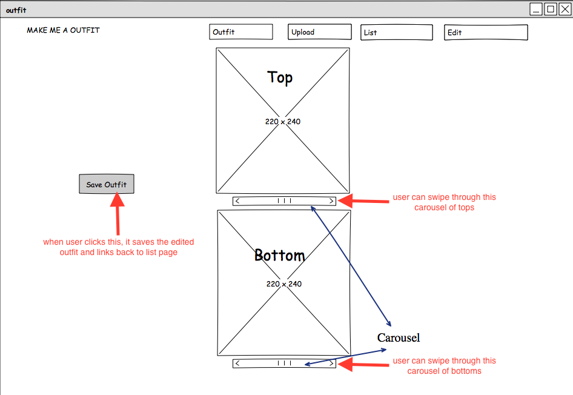
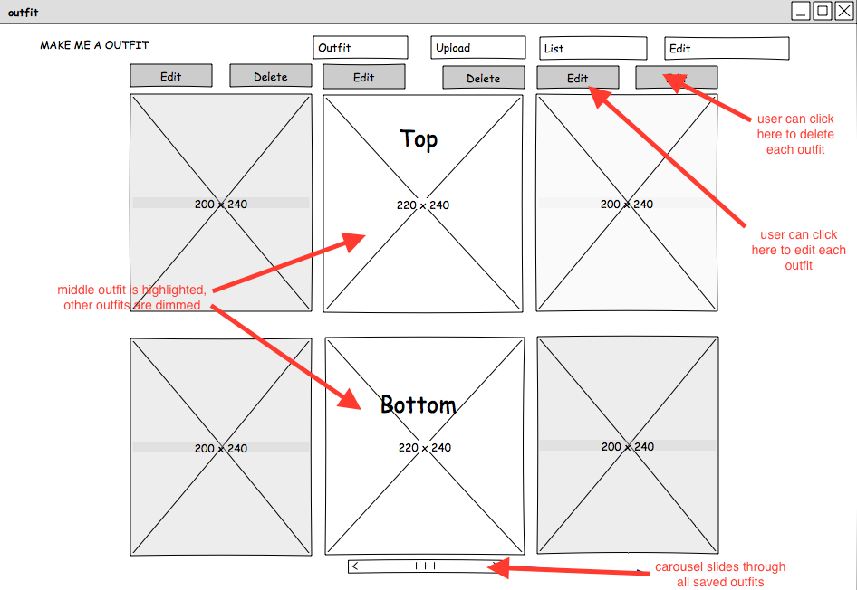
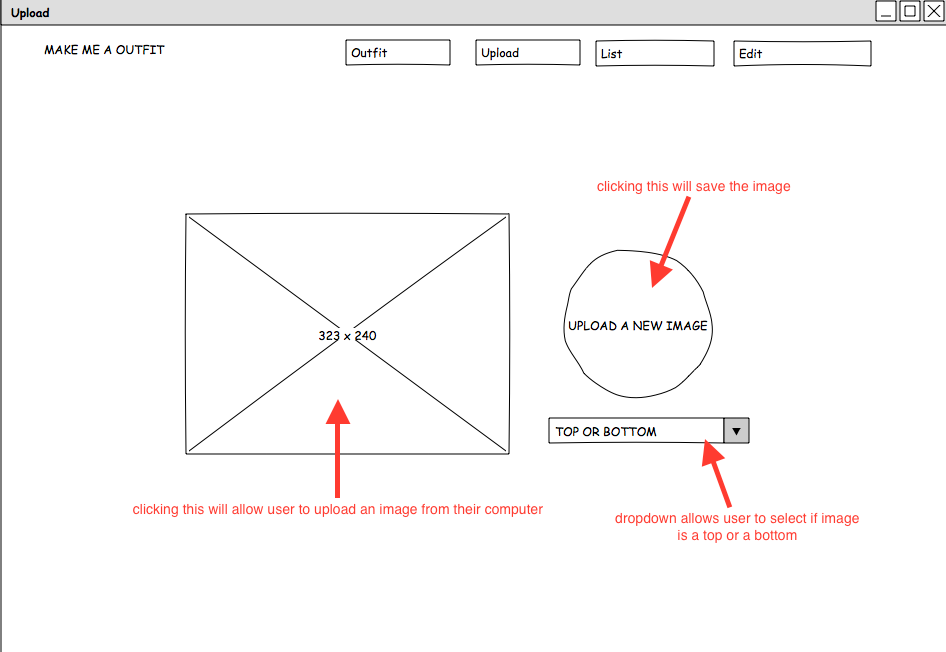

*** Aileen Wong, Mao Hung, MD Khan 9/19/17 ***

# Make Me An Outfit #

Mornings are rough - so take the ease out of outfit picking just a little bit easier. Make Me an Outfit is an app that allows you to shop your own closet. 

Users will upload images of items in the closet. Upon opening the app, Make me an Outfit will select a top and a bottom and piece them together. Users can save the outfits the app has created so they can reference them again or reshuffle the outfit. From the saved outfits page, users can edit the outfits they've made, reshuffling the tops or bottoms, or delete outfits they are tired of. 

## Priority Matrix ###

## Wireframes ###

#### Landing Page ###

#### Home Page ###

#### Edit Page ###

#### List Page ###

#### Upload Page ###

### Initial Thoughts on Structure ###
We would like to be able to use Cloudinary, a storage API, so that the user will be able to upload images from their closet into the app. This will help us determine how we are going to set up our database. For our presentation, we’re going to use images from a store website so that the look is cleaner. 

Once we understand how Cloudinary works, we will be able to populate our database with dummy data and begin working on our CRUD functionality. We’ll aneed to create a feed that the user can scroll through to view saved outfits, edit, and delete them. 

We would like to also like to learn how to use a carousel so that the user can scroll through the other uploaded images if they would like to change the image that the app selected for them. 

### Database ###

### Potential API ###
[Cloudinary API](https://cloudinary.com/documentation/solution_overview)

### Division of Work ###
Aileen - Git Tzar/React  
Mao - Cloudinary API/CSS/HTML  
MD - Databases/Node/Express  

### Deliverables and Time Spent on each ###
[Project Board on GitHub](https://git.generalassemb.ly/aileenmwong/project-3/projects/1)
